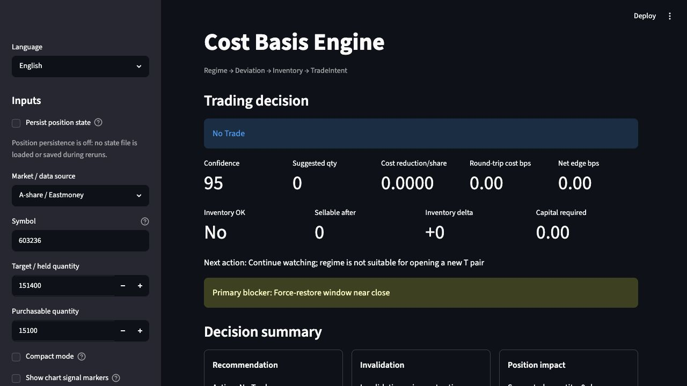
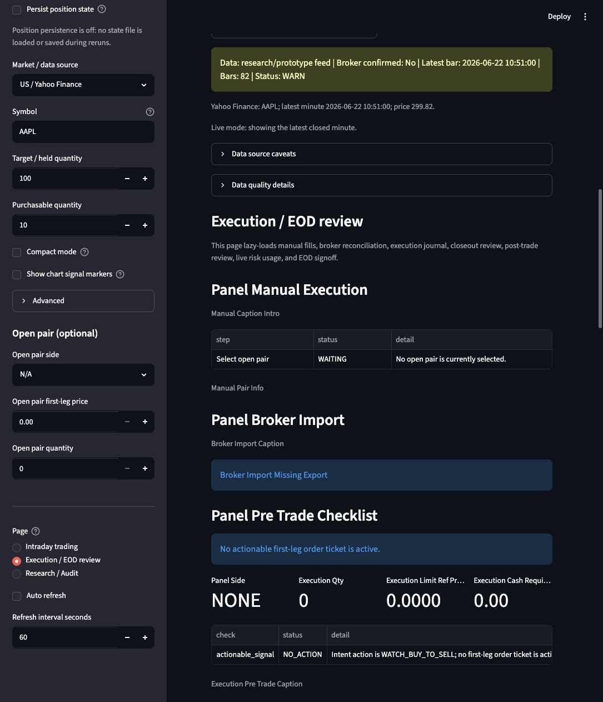
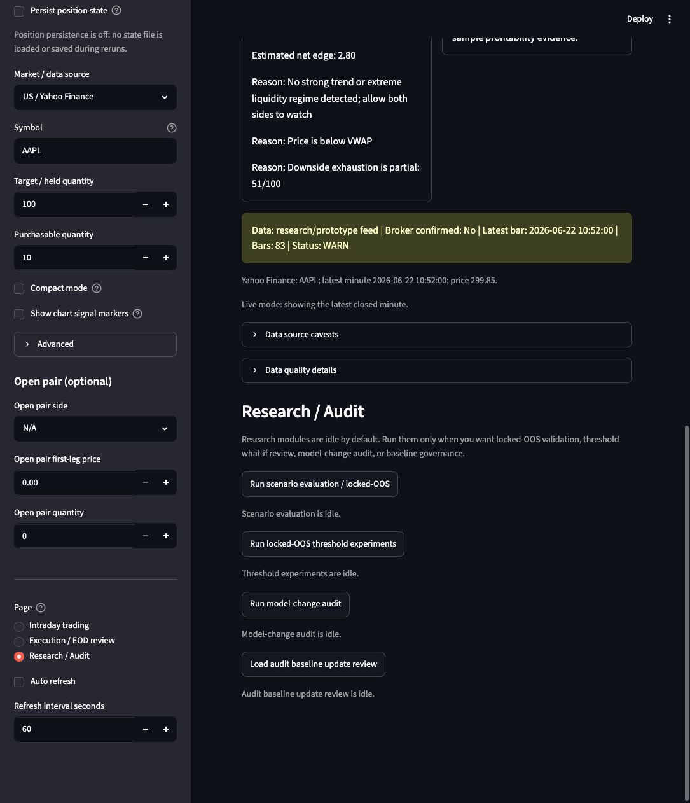

# Cost Basis Engine / 降本神器

Cost Basis Engine is a local Streamlit research dashboard for single-stock intraday cost-basis management. It focuses on one practical question: under a target inventory constraint, can a closed intraday T trade reduce cost basis versus doing nothing after fees, taxes, slippage, and inventory rules are applied?

The project is built as a research and decision-support prototype. It does not connect to brokers, does not place orders, and does not provide investment advice.

## Streamlit Gallery

### Intraday Decision Dashboard



The intraday page turns market data, position constraints, fee assumptions, and risk limits into a compact trade intent. The UI surfaces the current action, confidence, suggested quantity, cost-reduction estimate, blockers, and the decision rationale.

### Execution And EOD Review



The execution page is designed for operational discipline after a signal appears. It collects manual execution checks, broker-import reconciliation, pre-trade tickets, post-trade review, live risk usage, session closeout, and execution journal outputs.

### Research And Audit Controls



The research page keeps heavier validation jobs separate from the live decision view. It provides entry points for locked out-of-sample scenario evaluation, threshold experiments, model-change audit, and baseline governance.

## What This Demonstrates

- A Streamlit decision cockpit for a finance workflow, with a sidebar-driven configuration model and multi-page review flow.
- A layered signal engine: `Regime -> Deviation -> Inventory -> TradeIntent`.
- Inventory-aware T-trading logic that distinguishes sellable settled shares from same-day locked buys.
- Explicit fee, tax, slippage, position-size, and risk-limit handling before a suggested action is shown.
- A research-to-operations loop: intraday signal, pre-trade checklist, execution journal, post-trade review, and model audit.
- Market data adapters for A-share / Eastmoney and Yahoo Finance-backed Korea / US examples.

## Core Workflow

1. Choose a market/data source and symbol.
2. Enter held quantity, purchasable quantity, sellable quantity, risk preset, fee profile, and optional open-pair state.
3. Fetch recent intraday bars and build VWAP/deviation features.
4. Evaluate the layered trigger engine.
5. Show one of the unified actions:
   - `NO_TRADE`
   - `WATCH_SELL_TO_BUY`
   - `TRIGGER_SELL_TO_BUY`
   - `WATCH_BUY_TO_SELL`
   - `TRIGGER_BUY_TO_SELL`
   - `MANAGE_OPEN_PAIR`
   - `FORCE_CLOSE_OR_RESTORE`
6. Review execution readiness and end-of-day closeout if a trade is actually taken.

## Key Capabilities

- Configurable commission, minimum commission, stamp tax, transfer fee, other fees, and slippage.
- A-share lot-size and same-day sellability constraints.
- Korea and US Yahoo Finance examples for minute-bar signal prototyping.
- Compact live decision mode and expanded diagnostic mode.
- Signal marker scan for opportunity lifecycle review.
- Manual fill capture and broker-export reconciliation.
- Pre-trade order ticket preview and execution-sensitivity checks.
- Session risk usage, session closeout, session ledger, and end-of-day review.
- Locked OOS evaluation, threshold experiments, and model-change audit reports.
- Pytest coverage for accounting, trigger behavior, risk limits, dashboard outputs, and CLI paths.

## Quick Start

Create a local environment and install the runtime dependencies:

```bash
python -m venv .venv
source .venv/bin/activate
pip install -r requirements.txt
```

Launch the Streamlit dashboard:

```bash
streamlit run app/dashboard.py
```

Run tests:

```bash
python -m pytest
```

## CLI Examples

Replay a synthetic mean-reversion scenario:

```bash
python -m app.cli replay --scenario mean_revert --target-qty 1000 --settled-sellable-qty 1000 --trade-qty 100
```

Evaluate the trigger engine with an A-share symbol:

```bash
python -m app.cli trigger --symbol 603236 --held-qty 151400 --purchasable-qty 15100 --ignore-fees
```

Evaluate a Yahoo Finance-backed example:

```bash
python -m app.cli trigger --data-source yahoo --symbol 005930.KS --held-qty 1000 --purchasable-qty 100 --ignore-fees
```

Run a prompt-style intraday scan:

```bash
python -m app.cli prompt --symbol 603236 --bankroll 8000000 --scan
```

Monitor a symbol and print prompts periodically:

```bash
python -m app.cli monitor --symbol 603236 --bankroll 8000000 --interval-seconds 60
```

Optional push-notification providers are available through Bark, Pushplus, or a generic webhook:

```bash
python -m app.cli monitor --symbol 603236 --bankroll 8000000 --notify-provider bark --notify-token YOUR_BARK_KEY
python -m app.cli monitor --symbol 603236 --bankroll 8000000 --notify-provider pushplus --notify-token YOUR_PUSHPLUS_TOKEN
python -m app.cli monitor --symbol 603236 --bankroll 8000000 --notify-provider webhook --notify-url https://example.com/hook
```

## Repository Layout

```text
app/        Streamlit dashboard, CLI, execution journal, reconciliation, review flows
core/       Accounting, inventory ledger, fee model, instrument rules, pair state
data/       Eastmoney and Yahoo Finance data adapters plus validation/storage helpers
research/   Trigger engine, features, evaluation, replay, risk limits, audit reports
datasets/   Locked and sample OOS datasets
docs/       Product, architecture, decision, evaluation, and research notes
tests/      Unit and dashboard behavior tests
```

## Data And Risk Notes

- Eastmoney and Yahoo Finance adapters are used for research/prototype data only. Confirm data licensing, latency, field definitions, and survivorship assumptions before any real trading workflow.
- Yahoo Finance minute data does not provide true turnover for some markets; the prototype may approximate notional volume with `close * volume`.
- Intraday replay only emits a signal after minute `t` closes and simulates the earliest possible fill at minute `t+1`, avoiding look-ahead behavior in the replay frame.
- Cost-basis reduction is not counted as realized until both legs close, target inventory is restored, and fees/slippage are deducted.

## Current Non-Goals

- No broker connection.
- No automatic order placement.
- No Level-2 order book, tick-by-tick queue modeling, or active-buy/sell pressure model.
- No claim that any strategy is profitable.

## Portfolio Reference Angle

This repository can be presented as a compact example of building a finance-focused decision-support app: data adapters, rules engine, risk controls, operational review surfaces, research audit modules, and a Streamlit UI that turns those pieces into a usable workflow.
